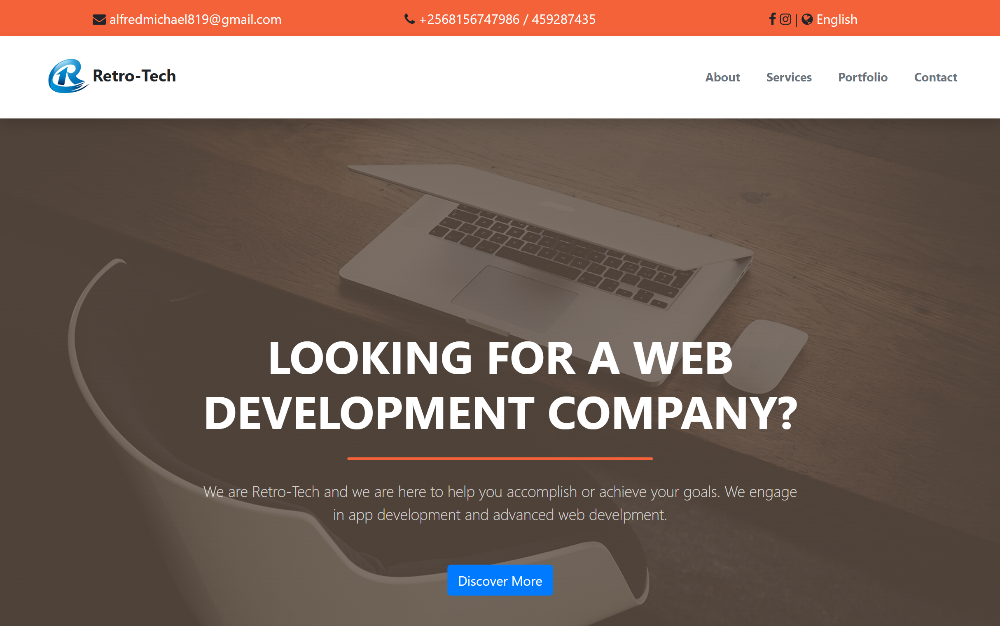
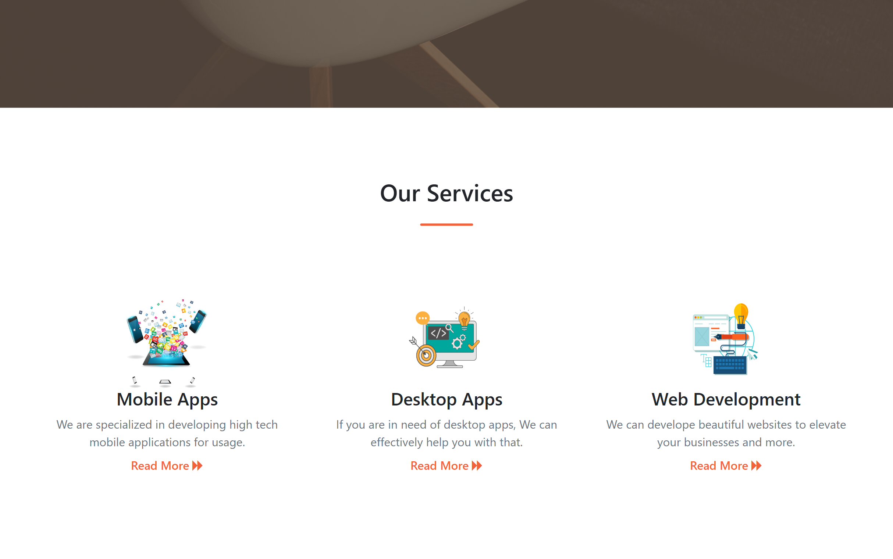
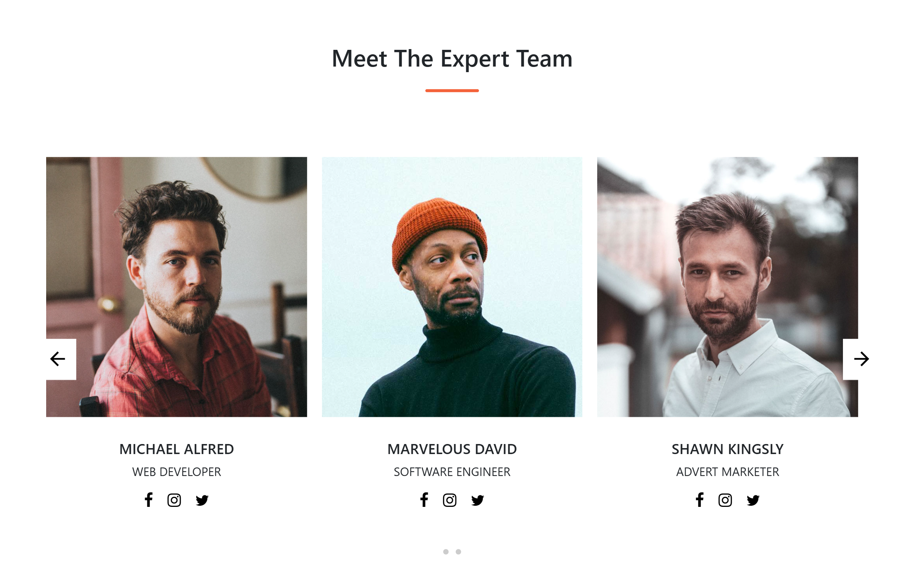
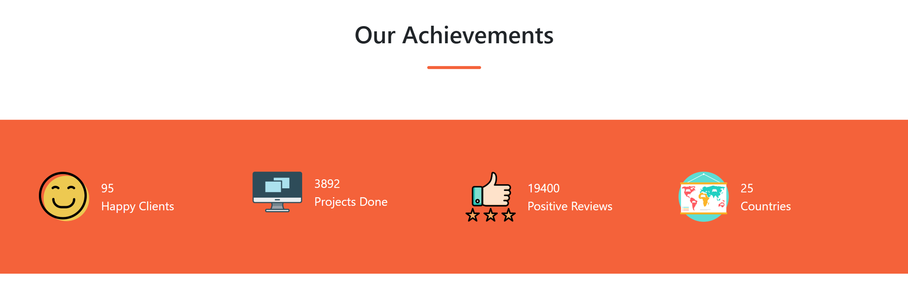
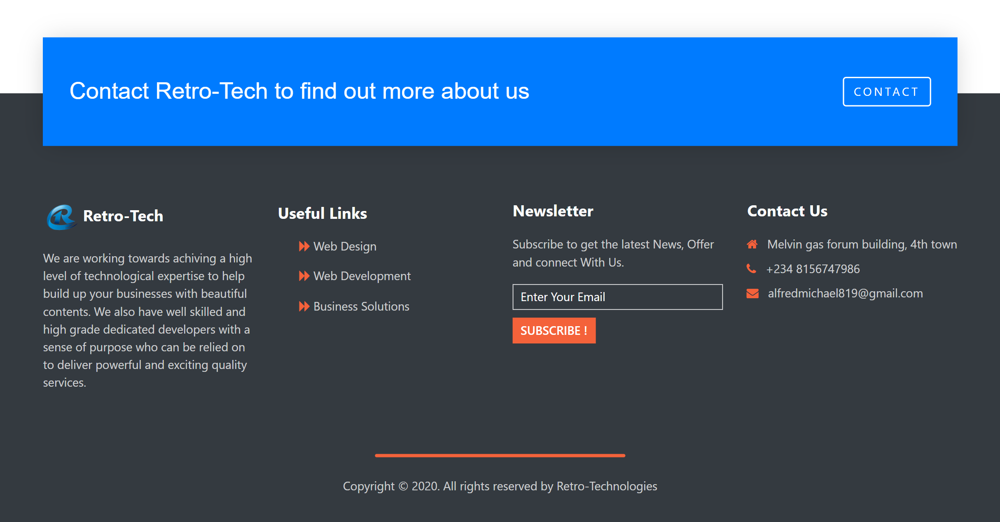

# Retro Tech
This is a frontend website I built in 2020 as a personal hobby project for a web development company concept, using plain HTML and CSS, along with jQuery and Bootstrap. The goal was to practice and showcase frontend skills by designing a clean, professional-looking company site, with a focus on layout, responsiveness, and overall user experience.

The site was not built for production use or for a real client, but rather as a learning exercise and creative exploration during that period. It reflects the tools, design trends, and development approach I was using at the time.

## Preview

